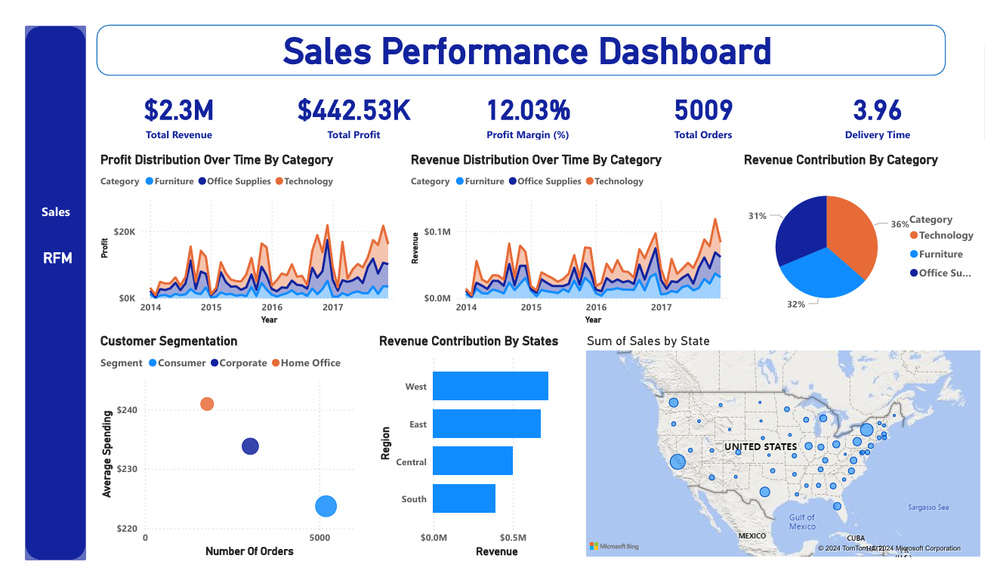

# Sales Performance and RFM Analysis with Python and Power BI
## I. Project Overview
- This project aims to clean and preprocess sales data, perform exploratory data analysis (EDA), conduct RFM (Recency, Frequency, Monetary) analysis, and segment customers based on RFM scores.
- Used preprocessed data to create interactive Sales Performances, RFM Analysis Dashboard by Power BI
- Built a K-means clustering model to segment customers into cohorts by RFM metrics 
- Tools: Python, Power BI
## II. Installation
Please clone this git respiratory: https://github.com/CeciliaDinh/Retail-Sales-Analysis-Visualization.git
## III.  Power BI dashboard
- I use Power BI to create a Sales Performance Dashboard and RFM dashboard
### Sales Performance Dashboard

### IV. Charts: 
### 1. Pie Chart: 
### 2. Area Chart:
### 3. Bubble Chart:
### 4. Rank Chart:
### 5. Geo Map:
### 6. TreeMap Chart:
